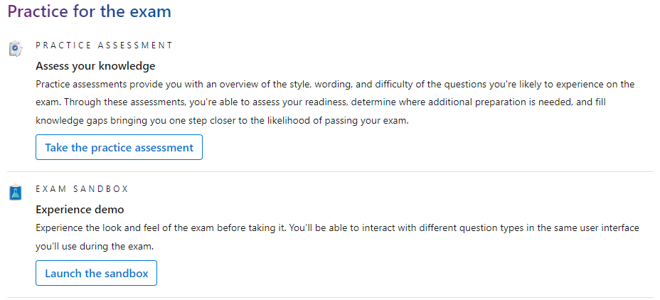
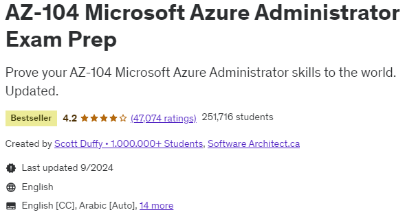
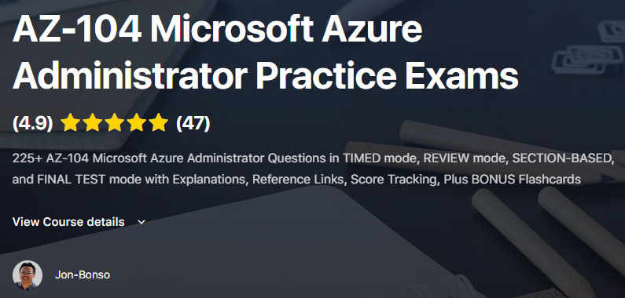

It’s no secret that the world of technology moves at light speed when it comes to adopting new tools, platforms, and innovations. Much like how “AI” has become the buzz word of these past couple years, “Cloud” is probably up there as another hyped up term in the current state of tech.

This past summer throughout my internship at Cisco, I decided that I would try and take advantage of my time to keep up with the skills of tomorrow. I figured that it would never be a waste of my time to learn new skills! Especially as someone aspiring to be in security, having knowledge of one of the large providers for IT infrastructure was a no-brainer.

I’ve had previous experiences with both AWS and Azure environments and chose to get some learning on the Azure platform due to some peer recommendations, my past experience with tools like Windows Active Directory, and the fact that the Azure offerings seemed to have a more extensive range of services.

Off to some guidelines!

## Key Learning Objectives

After spending the 2-3 months of my summer studying for this certification, I would say that I’ve really learned a great deal! It’s a pretty expansive certification but I’ve consolidated the main points… here’s an outline of the main topics to see if it’s worth it for you:

**Virtual Networking**
- Understanding Azure’s virtual network infra
- Setup of VPNs, firewalls, network security groups (NSGs)

**Managing and deploying Azure compute resources**
- Provision and manage VMs
- How to scale resources

**Managing storage**
- Azure storage data access, security
- Performance monitoring

**Identities & Governance**
- Access control, IAM
- MFA
- Resources access management

**Backups and monitoring Azure resources**
- Health monitoring of all our resources
- Disaster recover planning through replication

I would say the largest portion of the exam boils down to understanding the Azure virtual network infrastructure as well as the specific tools that are helpful to deploy and protect resources.

## Important Resources

Unlike the CompTIA Security+ of which I’ve had previous experience with, I would say that the Azure Associate Administrator is much less theoretical of a certification. The majority of the time spent studying for the certification should be getting hands on in practice!

##### Microsoft Learn (Free)

Below is the link to the Microsoft site in order to get hands-on with some of the Azure resources that they tailor in modules for practice! Furthermore, they have a practice exam which I would recommend taking once you’re confident in the content in order to get the most out of the sample exam.

[https://learn.microsoft.com/en-us/credentials/certifications/azure-administrator/?practice-assessment-type=certification#certification-practice-for-the-exam](https://learn.microsoft.com/en-us/credentials/certifications/azure-administrator/?practice-assessment-type=certification#certification-practice-for-the-exam)

##### Scott Duffy AZ-104 Exam Prep

Although it is nice, the free Microsoft prep is definitely not enough in order to gain experience in all aspects of the Azure suite of tools. For this, I took the Scott Duffy Exam Prep which compliments the Microsoft Learn material very well to provide an all around comprehensive guide to prepping!

The exam prep has each course topic broken down and organized in a very comprehensive way

##### TutorialsDojo ($15 for practice exams)

Once I went through the designated modules, I would highly recommend going through the TutorialsDojo practice exams which helped me a great deal when taking the real deal. Particularly, these practice exams had similarly worded questions mirroring the difficulty of the exam.

I would personally say that the exams in this course are a bit harder than the certification exam but as a result are a pretty good measure of how ready you are to take the exam! (I was consistently scoring ~80% right before I took my exam)

## Final Thoughts

As someone trying to land somewhere in security, earning the AZ-104 was a guided way to open doors for my personal career advancement in managing a secure and scalable Azure environment. After all, there are also many cloud-centric organizations in the current landscape.

Please reach out if you have any other questions!

Thanks,

Austin
