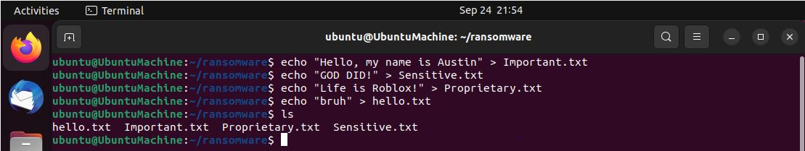
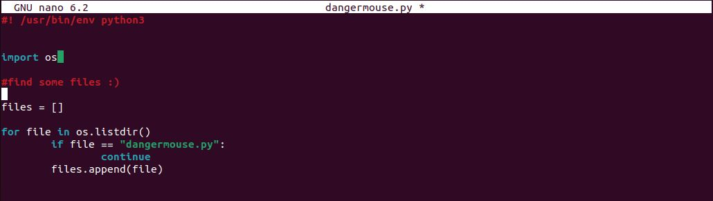
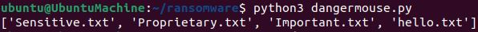
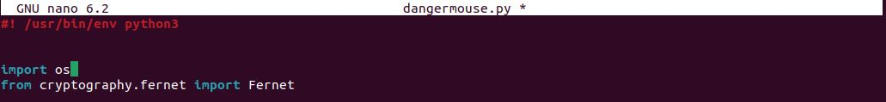
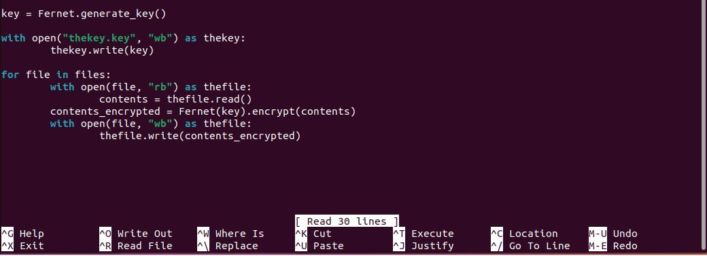
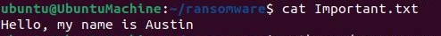
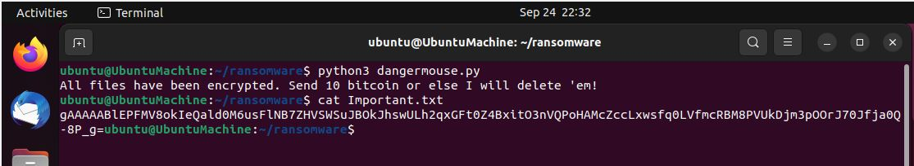
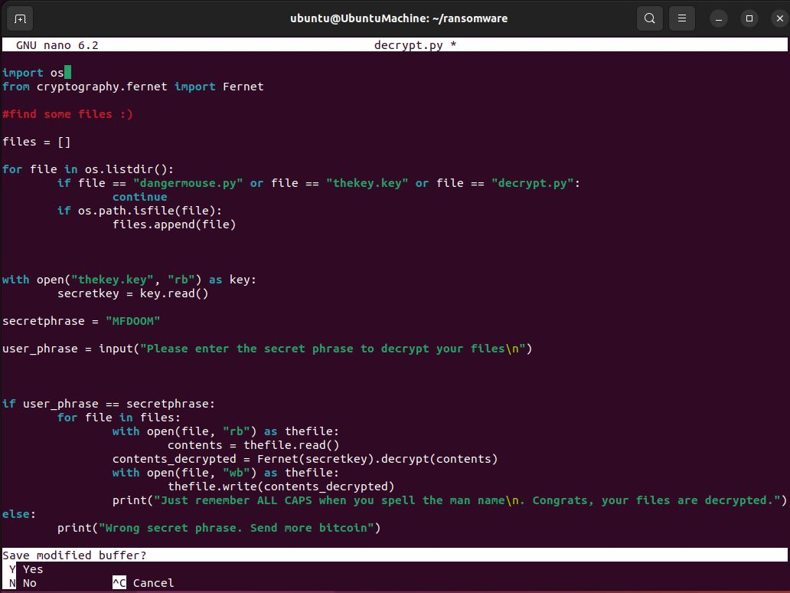
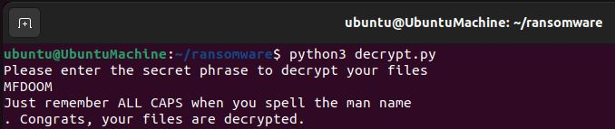

Hello!

This past weekend I checked out NetworkChuck’s video on creating malware using python and created my own ransomware. This is a cool demo that I tried within my VMs to understand some of the basics of how ransomware works (for learning purposes only).

**It’s scary how simple this lab was!** If you plan on making something similar, please make sure that it is only for educational purposes, in no way should this be used against others without their permission.

Below will include the steps I took to make the script and my overall takeaways!

Please make sure that if you plan on trying this lab out that you have a *disposable* VM on hand since we do not want to accidentally ruin any real files. After running up my Ubuntu VM, the first step I took was to make a couple example files that I want to eventually encrypt with the script, “hello.txt, Important.txt, Proprietary.txt, and Sensitive.txt.”

### Let’s grab the files!

To start the script, I assigned a list called `files`. To gather all the files, we can assign a for loop that will go through every file within the directory and append it. We also want to make sure that if our script goes through every file that it makes an exception for our malware file titled, “dangermouse.py”.

I added a quick print statement just to show that the script was able to compile these files shown in the image above.

### Time for Encryption…!

In order to encrypt the files, I was able to utilize Fernet which is a symmetric encryption algorithm which means that there will be a single key that both encrypts and decrypts.

To generate a key I was able to follow the Fernet documentation. I made a new variable, `key`, used the open function in write mode to write out the key as a new file called `thekey.key`.

The next section utilizes the `open` function once again, reads the contents of each file, and assigns the content to the variable, `contents`.

The third part of this gets to the actual encryption of the file using the Fernet key to encrypt the contents of the file and assign it to the variable, `contents_encrypted`.

The final part of the script writes out the encrypted contents back into the original files that it read!

As you can see, the script took the value from each of our files, encrypted the contents, and wrote out the encrypted contents back into each of the files. **AWESOME**!

### So… how can we decrypt?

The decryption script is actually not that different than the encryption script. Rather than generating a new key and writing that out in the contents of each of the files, what we’ll want to do instead is establish a variable `secretkey` which is the decryption key that will be used to decrypt the files. Furthermore, we want to make sure that the user can input a secret code in order to decrypt the files. If the user inputs the correct phrase which in this case is “MFDOOM” then the files will be decrypted.

Yay! Our files have been decrypted.

### Conclusion

Overall, I know I still have a lot to learn although just running through the basics is something super fun to me! Although it is simple malware, it’s still really cool to walk through the process.

In the world of ransomware like the most famous WannaCry malware in 2017 that exploited vulnerabilities in the Windows SMBv1 server, I hope that I can continue to learn about how adversaries think so that I can better defend the systems I’m tasked to defend.

Credit again to NetworkChuck as well as Fernet for the learning resources that helped me make this project. Until next time!
