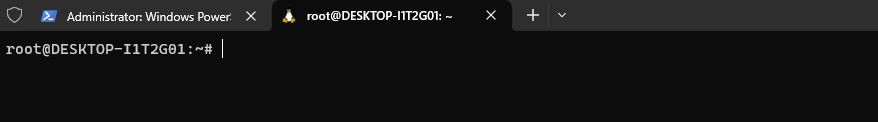
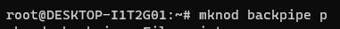
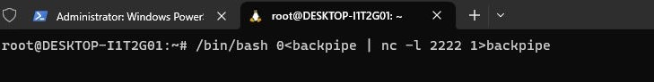
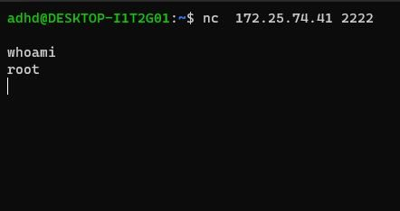
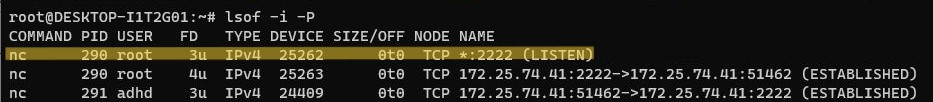
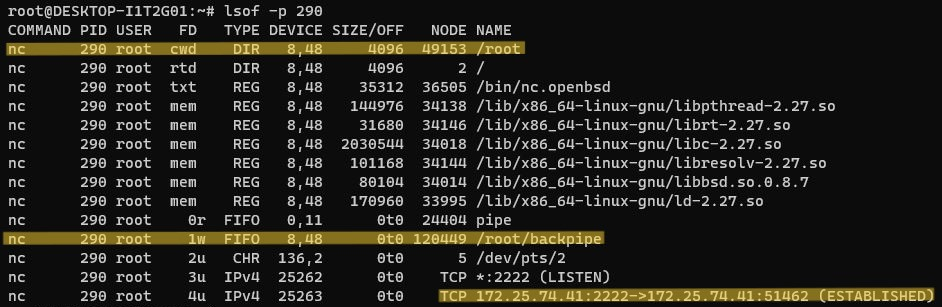
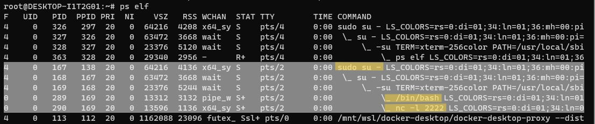

Hi everyone!

I have been incredibly lucky to stumble upon the online content posted by Black Hills Information Security Owner and Security Analyst, John Strand. All credit to John Strand and his online documentation for the lab that I was able to complete this past weekend!

The goal and learning from this lab highlights how a backdoor functions but also the information that a SOC analyst would be able to sift through in order to identify and piece together established connections. This was super fun and I highly recommend for anyone to check our John Strand’s GitHub [here](https://github.com/strandjs).

This entire lab was run through three Ubuntu terminals. One for our backdoor to connect to, one to run the script to connect through the backdoor, and a machine that would help us analyze the connection.

## Establishing a Backdoor

To run the backdoor, I had to first escalate to root privileges so that a different account would be able to connect through the backdoor.

We first establish a fifo backpipe by inputting the following command:

 **`mknod backpipe p`** creates a named pipe named ‘`backpipe`‘ and specifies that we are creating a FIFO pipe through the ‘`p`‘.

Next, we want to establish a bash script that will allow us to start this backdoor. Going through this lab, I learned hands on that our Linux machines communicate through different streams. If we’re going along this idea, I was able to signify where our input would be going by denoting the value “0” in this script. Comparatively, our standard output can be denoted through “1”.

Walking you through this script above, we are using a bash script that will take the input and read in from our backpipe. Through the netcat listener, the script will forward all information from port 2222 through the backpipe into our bash session and eventually take the output of the bash session back into the netcat listener.

This essentially creates our backdoor that will listen on port 2222! Once we run the script, it will wait for any input from port 2222 in which we will be able to connect and run code.

From a separate terminal, I was able to run the `netcat` command to connect to the IP address of our linux machine (we also specify the port). After running this command, I ran the `whoami` function to confirm that we have successfully entered through the backdoor!

## SOC Perspective

As highlighted in John Strand’s documentation, getting to the root privileges is important because a lot of the network connections and processing information will only be accessible with root access.

Below, I have opened a third terminal in which we will be doing the analysis of our connections:

We can use the command `lsof `which allows us to look at our open files. If we specify the `-i` flag, this narrows down our view to our internet connections. the `-P` flag gives us the specific port numbers of these open files. Above shows that we have found our backdoor running on any interface through port 2222!

To be even more thorough, we can utilize the process ID or the PID which can be a key piece of information to learn more about the running process. By inputting` lsof -p ____` (lowercase p), we can learn more about the specific process ID.

As we can see above, I specify the PID of the backdoor which is 290 to show a couple key pieces of information:
1. Our current working directory (cwd) is in the /root directory
2. Our pipe is first in first out (FIFO) working within /root/backpipe
3. The IPv4 address and port of which our backdoor is listening from

If we want a visual representation of these processes, we can even use `ps elf` to see a branching structure of how each of our processes are running.

As highlighted above, if I were a SOC analyst trying to dissect suspicious connections, this is another command that would provide me information on how this service was established IN ORDER.

## Takeaways

Overall, I’m sure that this lab is the tip of the iceberg in terms of establishing backdoors as well as the ways in which a SOC analyst would be able to perform threat hunting but I was thoroughly enjoying learning about the basics of performing these projects!

Being able to understand how these connections are established as well as the many possible ways in which we can learn about the running processes can help me in my future if I were to start my career working within a security operations center.

That’s all for now, thank you for tuning in!

– Austin
