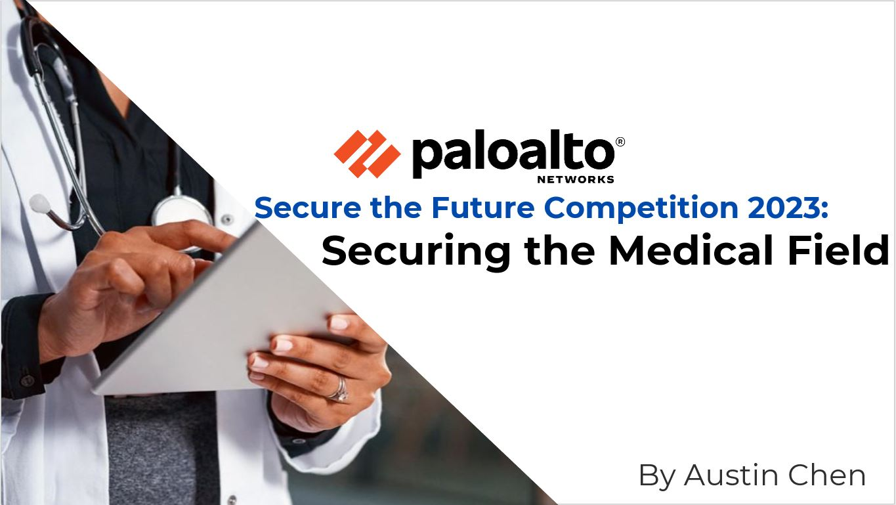
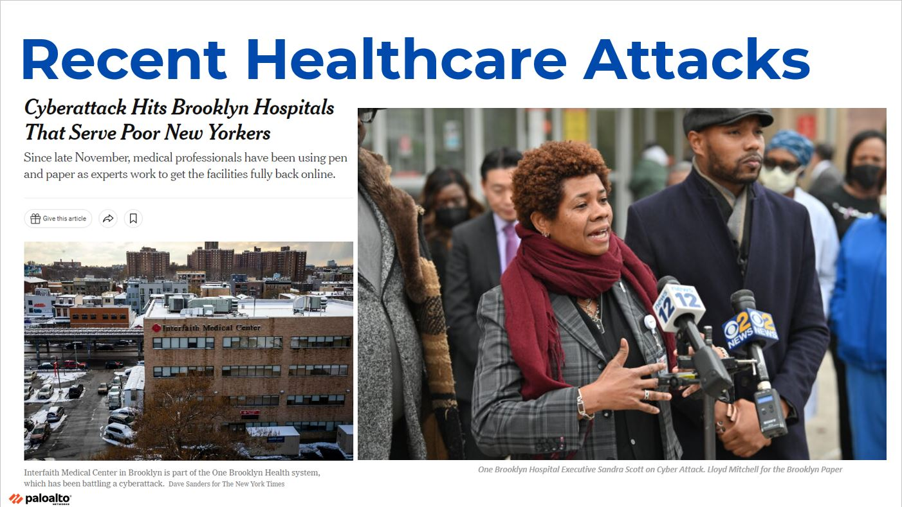

In an ever-evolving digitally-connected world, the frequency of cyberattacks targeting business systems is surging at an alarming rate. This obviously poses a significant threat to companies of all sizes, from small enterprises to large corporations, jeopardizing both their operational capabilities and their reputation. According to Cybersecurity Ventures, cybercrime costs are on a trajectory to hit $8 trillion by the end of 2023 and will increase by an additional $2.5 trillion by 2025. Given this context, it is more crucial than ever stay on top of emerging cyber threats and equipping people with solutions to safeguard our systems and applications.

Earlier this year, I had the amazing privilege of being among the top ten candidates across the country invited to virtually connect with Palo Alto Networks’ headquarters in Santa Clara, CA, for the finals of the 2023 “Secure the Future” competition. This competition was specifically designed to challenge student candidates in making critical decisions related to the protection of operational assets. It required us to analyze, compare, and select advanced security tools, methodologies, and implementation strategies. Throughout the competition, we were tasked with researching and crafting a competition report, creating a concise summary video, and preparing a presentation that outlined approaches for deploying end-to-end attack detection, alert management, threat hunting, investigative procedures, orchestration, and automated incident response.

As someone that is aspiring to leverage my skills and ideas to help others, I chose the healthcare industry because of the recent attacks on hospitals as well as healthcare institutions.

**Slide 4 from my presentation pictured above.**

My experience doing research and ideation after talking with industry leaders well as employees within healthcare institutions was an amazing experience as I was able to experience for myself the need for a strategy within the field. Although there are many different answers to this problem, after my four months of research I concluded that the greatest change needs to be within culture. Through key solutions such as enterprise security platforms that can be configured to automate access control as well as SIEM duties combined with a culture of responsibility, I believe that securing the healthcare industry is possible!

Of course, I’m still early along my journey as a cybersecurity professional although I believe that I have learned a great deal of skills from this competition. Being able to think on my feet and apply tangible research to my ideas will be something that I carry on with me into the rest of my career.

I want to thank all the mentors as well as my fellow competitors that represented the 2023 cohort. I also highly recommend any student with a drive to make change in cyber to pursue the competition. My tips:
1. Be authentic in your pitch, choose a topic you are passionate about
2. Be proactive with reaching out to people and ask questions
3. Trust the process (the more effort you put into the competition, the more you will get out of it)
