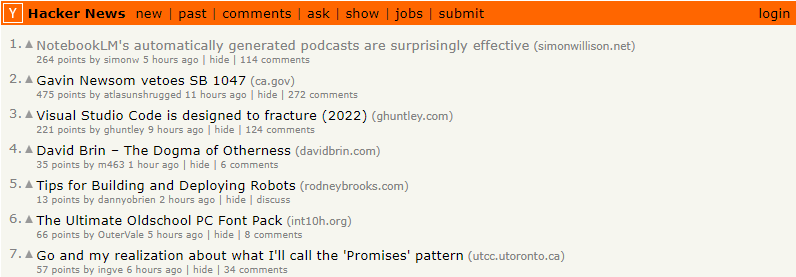
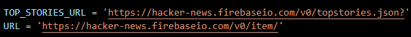
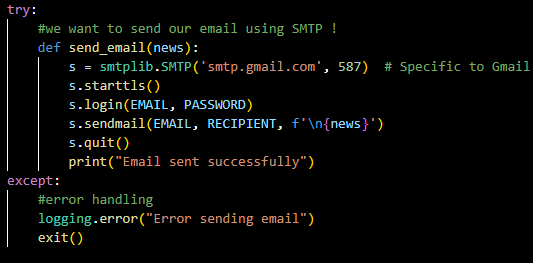
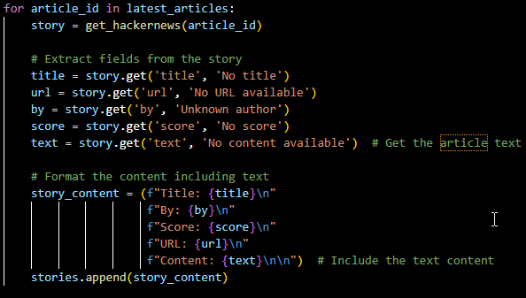
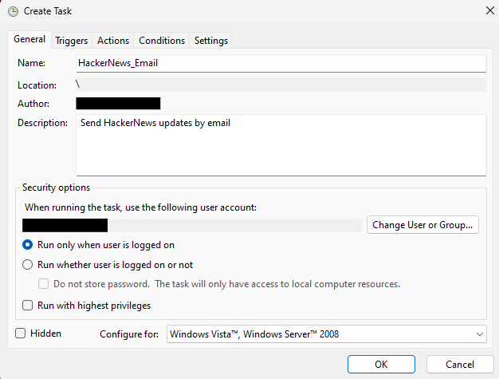
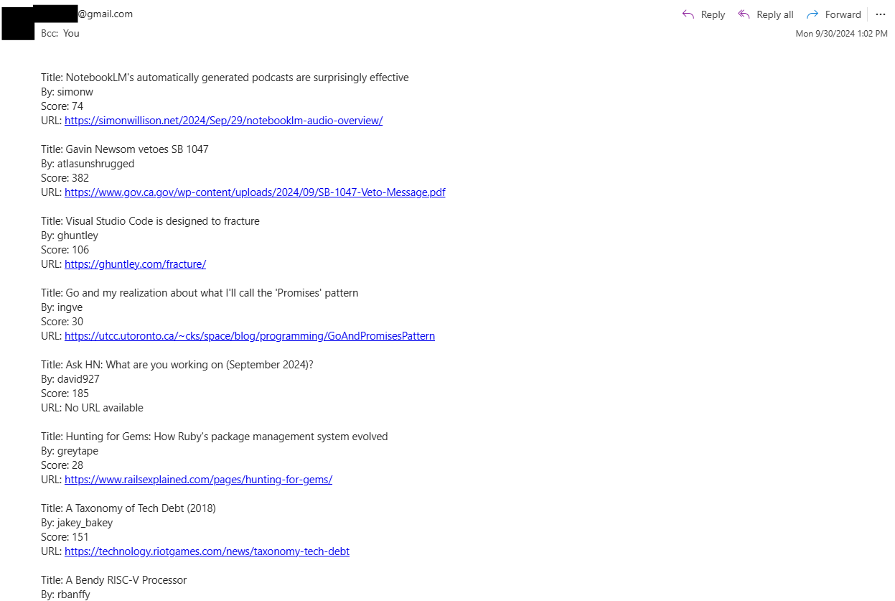

(So Time Spent Checking My Emails are More Productive)

I was recently thinking of ways that I could make time spent on my phone more productive. I recently deleted apps like YouTube and Instagram limiting myself to only view on my laptop for my own good (which seems to be reducing my time spent on the addictive apps) but I feel like there are definitely ways that I can introduce some more productive content to my social media feed…

Although I could definitely read the news on my phone on my way to class, I thought that having some nice tailored content to sent to my email like a personal newsletter was something that I could automate.

Hacker News is one of the prominent sources of tech news that many of my peers consistently read. So if I want to develop some good reading habits with interesting content, I should have some of the content from Hacker News sent straight to email so I can read on my phone! Should be relatively straightforward…

## Methodology
I first was able to find the official [Hacker News API](https://github.com/HackerNews/API) on GitHub which provided me with some insight as to how I could specify the content in my code.

Secondly, I did some research on utilizing code to send an email from a Python file. I had to use the *`smtplib`* module to be able to send an email over Simple Mail Transfer Protocol (SMTP). All the specifications as what to specify are in the documentation in which I had to use the specific value of 587 to send a Gmail value.

I make sure to pull the top 10 story IDs of the past 24 hours which then populates into my URL template allowing me to get links, titles, authors, and upvote counts for my tailored newsletter.

I don’t think it’s reasonable nor smart to keep running a python file in order to send these emails so instead we can keep it simple using the Windows Task Scheduler. The interface should look similar to the screenshot below, all you need to do is specify the intervals and the file that you want to run!

Once implemented, I now get this on my phone whenever I check my email! Of course there is plenty to do to make this look prettier but it’s a start. Time to get reading 🙂

To see the full project code, click [here ](https://github.com/austin321/Python_Automation)to see my Python automation projects! I even made a spin-off which sends a random joke to an email as well. Feel free to make your own edits.

Until next time,

Austin
